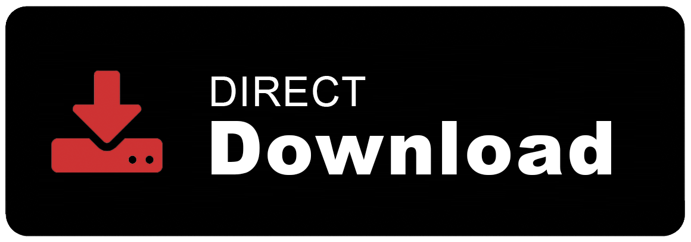

## Contributing Guidelines

## Assets
- [kutt.it API](https://github.com/thedevs-network/kutt#api) is used to retreive shortened URLs.
- QR Code is generated using <a href="http://goqr.me/">`http://goqr.me/`</a> API

## Development
- `npm install` to install dependencies.
- `npm run dev` to to watch file changes in developement 
    - (Reload Extension Manually in the browser)
- Load extension via as unpacked from `extension/` directory.
- Generate an API Key from <a href="https://kutt.it">`https://kutt.it/`</a> (Settings page)
- Paste and Save the `Key` in extension's `options page`.

`npm run build` builds the extension to `extension/` directory.

## Testing
Download latest `Pre-Release`

## ToDO

- [ ] Switch to Promise return Method
- [ ] Fix UI issues in Firefox
- [ ] Using Node-Kutt package(feature request)

## Note:
Shortening may take a while, it's not the issue with the extension but with <a href="https://github.com/thedevs-network/kutt">Kutt.it's API</a>.