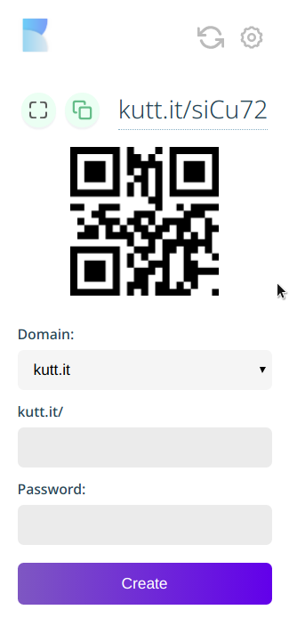

<h1 align="center">kutt-extension</h1>

Browser extension to shorten long URLs based on <a href="https://kutt.it">Kutt.it</a>

  
  
  
  
  
  

<h3 align="center">🙋‍♂️ Made by <a href="https://twitter.com/_abhijithv">@abhijithvijayan</a></h3>

  Donate:
  <a href="https://www.paypal.me/iamabhijithvijayan" target='_blank'><i><b>PayPal</b></i></a>,
  <a href="https://www.patreon.com/abhijithvijayan" target='_blank'><i><b>Patreon</b></i></a>

  

### v2 React + TypeScript (🚧 [WIP](https://github.com/abhijithvijayan/kutt-extension/tree/refactor/react-typescript))

## Features

- Minimal UI
- Instant QR Code
- Cross Browser Support
- Supports Secure Passwords for URLs
- History & Incognito Feature
- Auto Copy Feature
- Free and Open Source
- Uses WebExtensions API

## Browser Support

|  |  |  |  |  |  |  |
--------------------------------------------------------------------------------------------------------------------------------------------------------------------------- | --------------------------------------------------------------------------------------------------------------------------------------------- | ------------------------------------------------------------------------------------------------------------------------ | --------------------------------------------------------------------------------------------------------------------------------------------------------------------------- | ------------------------------------------------------------------------------------------------------------------------------------------------------------------------ | ------------------------------------------------------------------------------------------------------------------------------------------------------------------------------ |------------------------------------------------------------------------------------------------------------------------------------------------------------------------------ |
| 49 & later ✔ | 52 & later ✔ | 36 & later ✔ | 79 & later ✔ | Latest ✔ | Latest ✔ | Latest ✔

## How to use

- Download for browser(s)

  - Chrome: [Kutt :: Chrome Web Store](https://chrome.google.com/webstore/detail/kutt/pklakpjfiegjacoppcodencchehlfnpd)
  - Firefox: [Kutt :: Add-ons for Firefox](https://addons.mozilla.org/firefox/addon/kutt/)
  - Opera [Kutt :: Opera addons](CONTRIBUTING.md#for-opera-users)
  - Edge: [Kutt :: Chrome Web Store](https://chrome.google.com/webstore/detail/kutt/pklakpjfiegjacoppcodencchehlfnpd)

- Generate an API Key from <a href="https://kutt.it">`https://kutt.it/`</a> after signing up. (Settings page)

  

- Paste and Save this `Key` in extension's `options page` when asked.

 

## Screenshots

  

 

## Note:

- <a href="https://kutt.it">Kutt.it</a> API permits **50** URLs shortening per day using the API Key.
- **Enable Custom Host** option to use with self-hosted kutt
  - Save the self hosted domain in the input (eg: https://mykutt.it)
    - **Note**: the api endpoint is automatically appended during the api call.
- _Delay at times while shortening might be the issue with Kutt.it API and not with the extension's._

## Contributing and Support

View the Contributing guidelines [here](CONTRIBUTING.md).

Original Repo: [thedevs-network/kutt](https://github.com/thedevs-network/kutt)

## Show your support

Give a ⭐️ if this project helped you!

## Licence

Code released under the [MIT License](LICENSE).
